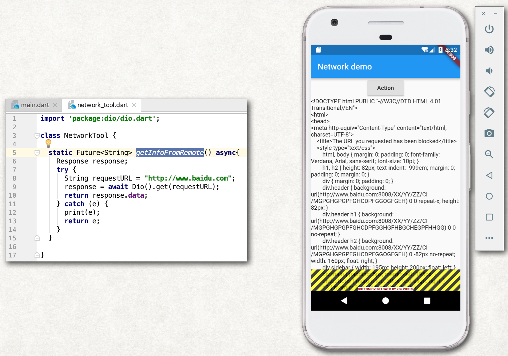

# Flutter sample project

## 1 - Hello world project

## 2 - Basic layout component

## 3 - StatelessWidget & StatefulWidget

## 4 - Async task

## 5 - Outside dependency & Network

## 6 - Communication with Native platform code

## 7 - Save&Load data to/from disk

